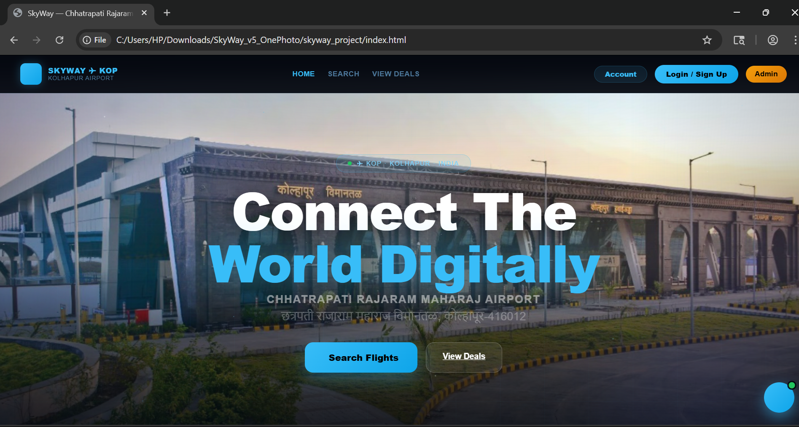

# SKYWAY KOP – Online Flight Booking System

## 📌 Project Overview
A web-based flight booking system developed as a BCA final year project.

## 🚀 Features
- Flight search
- Seat selection
- Booking system
- Boarding pass generation

## 🛠️ Technologies Used
- Frontend: HTML5, CSS3, JavaScript
- Backend: PHP
- Database: MySQL

## 📂 Project Structure
- Frontend: HTML, CSS, JS
- Backend: PHP
- Database: MySQL

## 👨‍💻 Developed By
Anuj Patil,
Srutika Sawant,
Vaishnavi Amble.

## 📸 Project Screenshots

### 🏠 Home Page

### ✈️ Flight Booking Page

### 🎫 Boarding Pass

### 📊 Admin Dashboard

### 🔐 Biometric Verification

